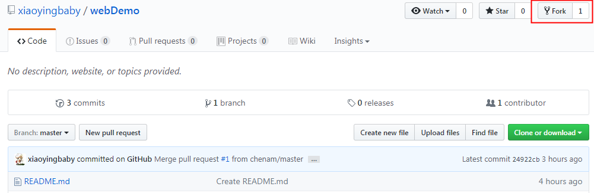
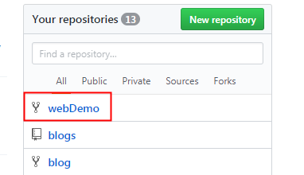
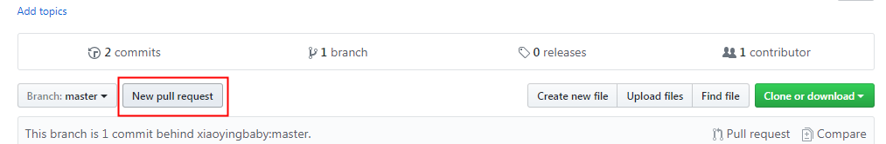
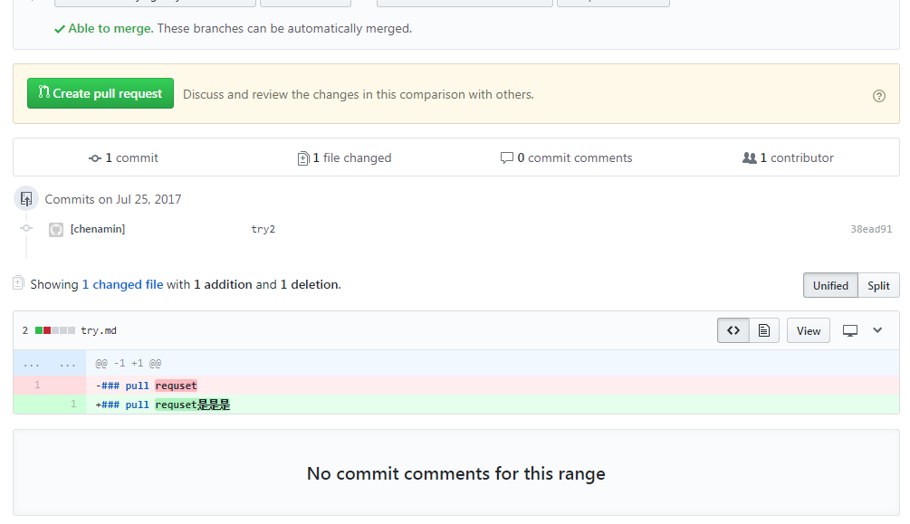
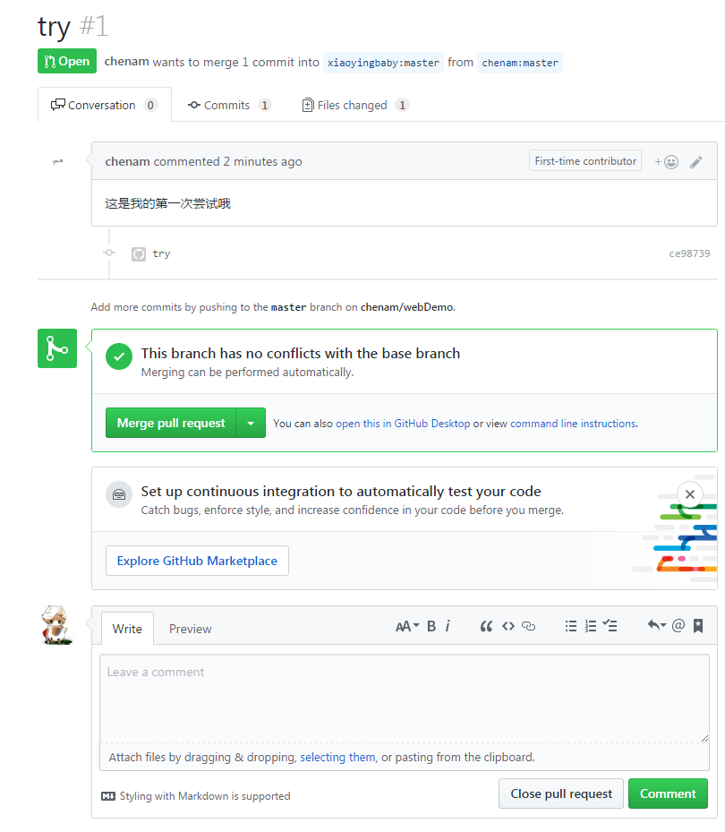

## git 使用


### git stash 

暂存当前正在进行的工作，不想commit

```
git stash // 暂存
git stash list// 暂存区列表
git stash pop stash@{0} // 将你指定版本号为stash@{0}的工作取出来,并删除
git stash apply stash@{0} // 将你指定版本号为stash@{0}的工作取出来,不删除
git stash clear //删除栈
```

### pull request

更正别人仓库里的错误

- fork别人的仓库，本地也会有这份拷贝。





- 从`自己的本地`clone到本地分支，然后bug fix xxxxx

```
xxx
xxx

git push origin xxx // 完成
```

- 在你`修改的分支`,发起pull request让`他`看到





- 添加一些注释信息，确认提交

- 等他看到


