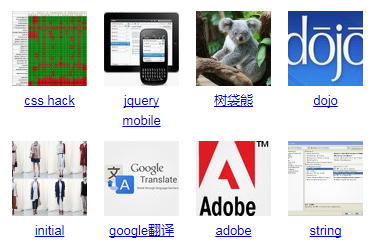

- 因为javascript的限制，Vue不能检测的变动数组(列表数据，改变单个状态,值改变了，但是视图没有更新)     
1. 直接利用索引直接改变一个项:      

```
vm.items[index] = newValue;   
```
2. 修改数组长度  

这时候如果一定要更新，可以用下面的方法，或者split也可以
```
this.$set(items,index,newValue);
```

    
- 父子组件通信(不用vuex的简单通信)&nbsp; [小demo][1]    

[1]: https://jsfiddle.net/0y7bsth4/7/

子组件也可以通过`this.$parent.xxFun();`调用父组件的方法

- 兼容性问题

1. IE10不支持.png格式的头部小标
2. safari不支持异步获取的url，window.open()打开。解决方法：`同步获取`,或者用下面的方法，但是下面的弊端是不管url是否存在都会打开新页面。
```
// ajax 之前打开新页面
    var winRef = window.open("", "_blank");
    ajax{
        success : function(){
            function loc(){
                var url = 'http://www.baidu.com';
                winRef.location = url;//改变页面的 location
            }
            setTimeout(loc(),200);//这个等待很重要，如果不等待的话将无法实现
        }
    }
```
3. IE10 p标签下面最好不要放其他标签，有时候会有解析问题
```
<P>
    <P>123</P>
</P>
```

会被解析成

```
<P></P>
<P>123</P>
<P></P>
```
- css3中的`calc`方法在less中如果写
```
div {width : calc(100% - 30px);} 
```
less会把这个当成运算式去执行，被解析成

```
<span style="font-size:14px;">div {width: calc(70%);}</span> 
```
应该写成

```
<span style="font-size:14px;">div {width : calc(~"100% - 30px");}</span>  
```

如果把30px替换成变量：

```
div {
　　@diff : 30px;
　　width : calc(~"100% - @{diff}");
}
```

- 多行，每行高度自动撑开，并向上排列,类似百度的




```
display:inline-block;vertical-align:top;
```