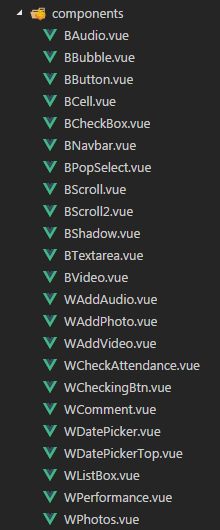

### 微课社团项目使用vue开发问题小结  
此次项目开发主要分五个模块：通知、作业、考勤、课堂表现、精彩课堂
#### 组件化开发
- 概览页面效果图，提取需要开发的组件  
  此项目中的组件目录  

组件里再细分大的组件和小的组件，例如社团列表页主要由一个大的列表组件WListBox组成，列表组件中又包含了其他小的组件WPhotos,WComment,WPerformance,WCheckAttendance,BAudio  

- 组件开发细节问题  
1. 开发组件的过程中注意单纯开发组件的样式，组件之外的布局结构不要考虑  
2. 注意其需要与父组件通信的地方，子组件在`props`中定义需要用到的参数，确保父组件可以通过`props`传递数据给子组件；子组件通过`this.$emit`触发一个方法传值给父组件 

子组件
```
<template>
    <span @click.stop="deleteItem" >删除</span>
</template>

methods: {
    deleteItem() {
        this.$emit('delete', this.index)
    }
}
```  
父组件
```
<div>
    <w-list-box @delete="deleteItem" :data="data" :index="index" v-for="(data, index) in msgList" :key="index" />
</div>

methods: {
    deleteItem(index) {
        this.msgList.splice(index,1);
    }
}
```
3. 父组件传值给子组件的时候只需传子组件需要用到的值，不要把所有的数据都传过去，如下代码只给WPhotos组件传了一个图片地址参数

父组件
```  
<div class="photos" v-if="data.picUrls">
    <w-photos :data="data.picUrls" />
</div>
```       
子组件  
``` 
props: {
    data: null,
}
``` 

4. 引用组件的时候记得先在`components`里定义组件  
```  
components:{
    WPhotos,
    ...
}
```  
